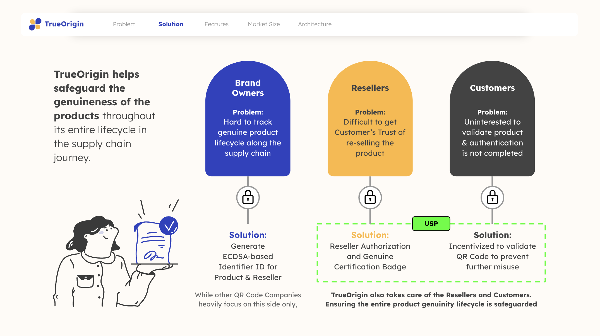
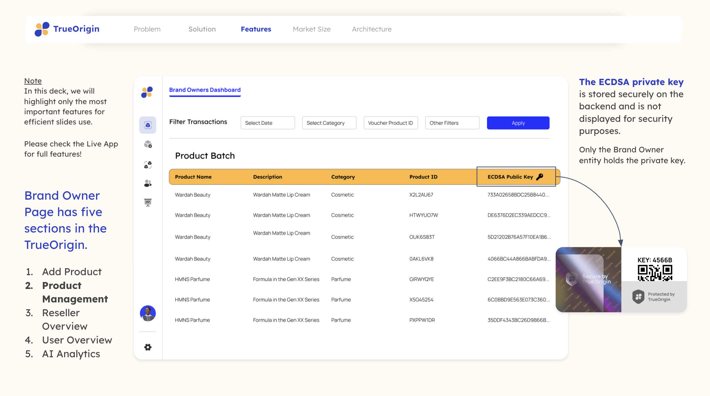
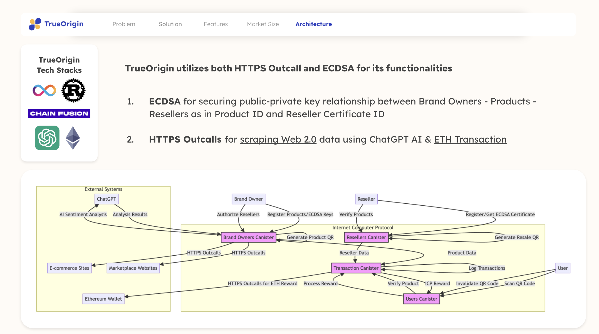

<h1 align="center">
    <a href="#">
        
    </a>
</h1>

Update Logs - 15.42 - Readme.MD (Upload Demo Video)

# TrueOrigin - ChainFusion HackerHouse - xChain Track
## Overview
TrueOrigin is an innovative anti-counterfeit system built on the Internet Computer Protocol (ICP), serving Brand Owners, Resellers, and Users. It leverages ICP's cross-chain capabilities, ECDSA for Product & Reseller Certification, and HTTPS outcalls for AI-Assisted product sentiment analysis and ETH transactions for Customer's QR Validation incentives.

Users earn ICP or ETH rewards by verifying product authenticity through QR code invalidation, creating a secure and incentivized product verification ecosystem.

<h1 align="center">
    </a>
</h1>

## Features
### ECDSA Features
The Product ID QR Code is bound with ECDSA, where the Brand Owner holds the Private Key for authentication. This ensures that each product is tamper-proof.
<h1 align="center">
    </a>
</h1>

Video Demo - Adding New Product ID and Generate ECDSA Key


### HTTPS Outcalls
After validating QR codes, customers earn crypto rewards in either ICP or ETH. Transactions involving ETH utilize HTTPS Outcalls protocols.
<h1 align="center">
    </a>
</h1>

Demo 1 - Setup Wallet

https://i.giphy.com/media/v1.Y2lkPTc5MGI3NjExcW85ZDc4bTRndjdna2Z1Y2o2dHI1MGUyem13Y2ppNzJ1bjFzOXF6aiZlcD12MV9pbnRlcm5hbF9naWZfYnlfaWQmY3Q9Zw/uoji0sELwFOyCOabMe/giphy.gif

Demo 2 - Redeem Crypto Coin as Incentives


AI Sentiment Analysis


## Repository Structure
This repo adopted monorepo repository

## TechStacks & Architecture
### Frontend
- React
- TypeScript
- Tailwind CSS
- Vite

### Backend
- Rust
- ICP
<h1 align="center">
    </a>
</h1>


# `TrueOrigin`

Welcome to your new `TrueOrigin` project and to the Internet Computer development community. By default, creating a new project adds this README and some template files to your project directory. You can edit these template files to customize your project and to include your own code to speed up the development cycle.

To get started, you might want to explore the project directory structure and the default configuration file. Working with this project in your development environment will not affect any production deployment or identity tokens.

To learn more before you start working with `TrueOrigin`, see the following documentation available online:

- [Quick Start](https://internetcomputer.org/docs/current/developer-docs/setup/deploy-locally)
- [SDK Developer Tools](https://internetcomputer.org/docs/current/developer-docs/setup/install)
- [Rust Canister Development Guide](https://internetcomputer.org/docs/current/developer-docs/backend/rust/)
- [ic-cdk](https://docs.rs/ic-cdk)
- [ic-cdk-macros](https://docs.rs/ic-cdk-macros)
- [Candid Introduction](https://internetcomputer.org/docs/current/developer-docs/backend/candid/)

If you want to start working on your project right away, you might want to try the following commands:

```bash
cd TrustOrigin/
dfx help
dfx canister --help
```

## Running the project locally

### Prerequisites
- Rust
- DFX
- Node JS

### Steps
If you want to test your project locally, you can use the following commands:

```bash
# Starts the replica, running in the background
dfx start --background

# install node dependencies
pnpm install

# Deploys your canisters to the replica and generates your candid interface
dfx deploy
```


Once the job completes, your application will be available at `http://localhost:4943?canisterId={asset_canister_id}`.

### Developing Backend

If you have made changes to your backend canister, you can generate a new candid interface with

```bash
dfx generate TrustOrigin_backend
```

This command will generate new `TrustOrigin_backend.did` file which are used by frontend to interact with backend.

### Developing Frontend

If you are making frontend changes, you can start a development server with (by default, this won't be connected to the backend):

```bash
npm start
```

Which will start a server at `http://localhost:8080`.

To connect to the backend, you need to deploy your frontend changes with `dfx deploy` command. Or follow the instructions below to connect to the backend.

### Common issues
if you get error like this
```sh
error[E0463]: can't find crate for `core`
  |
  = note: the `wasm32-unknown-unknown` target may not be installed
  = help: consider downloading the target with `rustup target add wasm32-unknown-unknown`
```

Run `rustup target add wasm32-unknown-unknown`

### Note on frontend environment variables

If you are hosting frontend code somewhere without using DFX, you may need to make one of the following adjustments to ensure your project does not fetch the root key in production:

- set`DFX_NETWORK` to `ic` if you are using Webpack
- use your own preferred method to replace `process.env.DFX_NETWORK` in the autogenerated declarations
  - Setting `canisters -> {asset_canister_id} -> declarations -> env_override to a string` in `dfx.json` will replace `process.env.DFX_NETWORK` with the string in the autogenerated declarations
- Write your own `createActor` constructor
