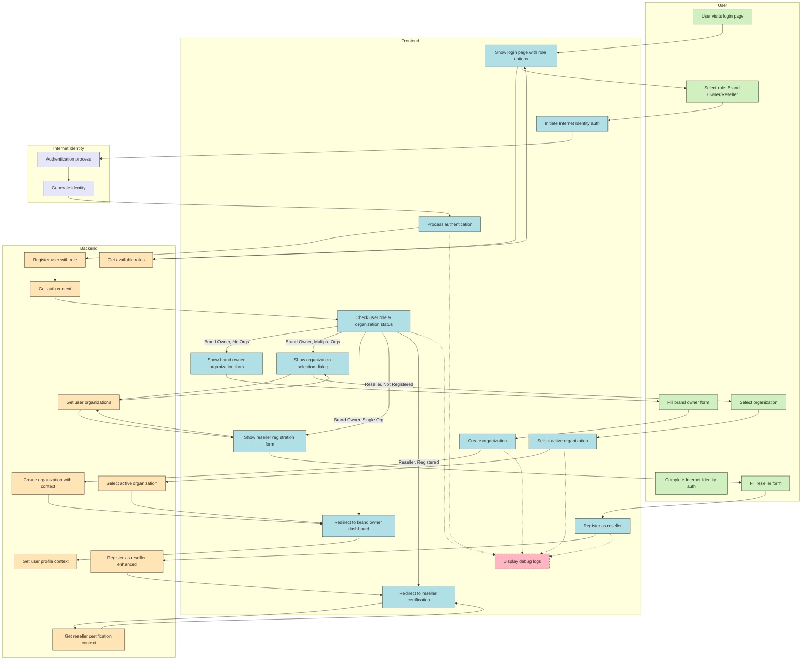
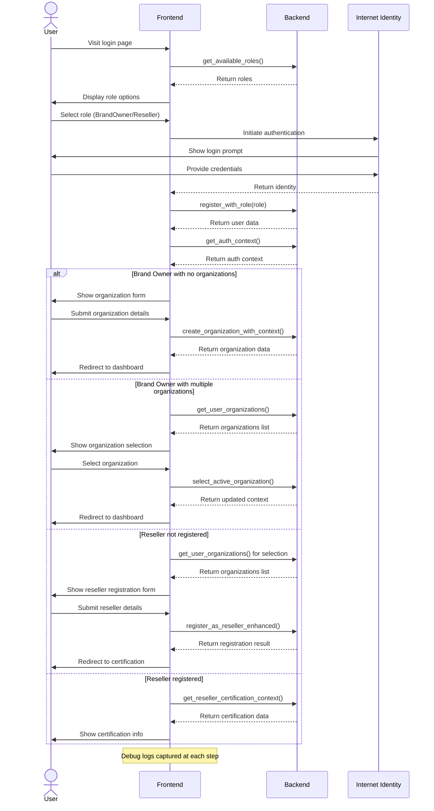
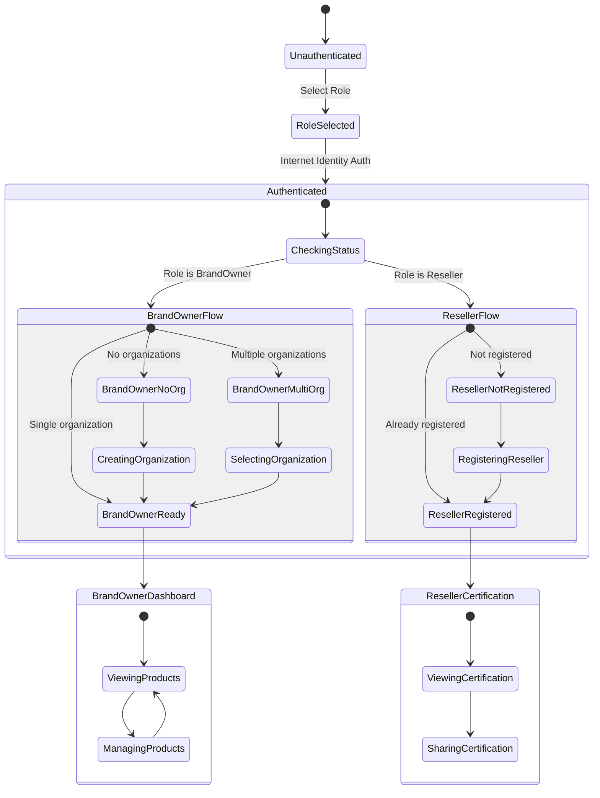
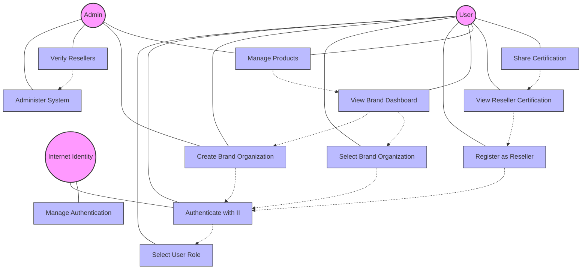
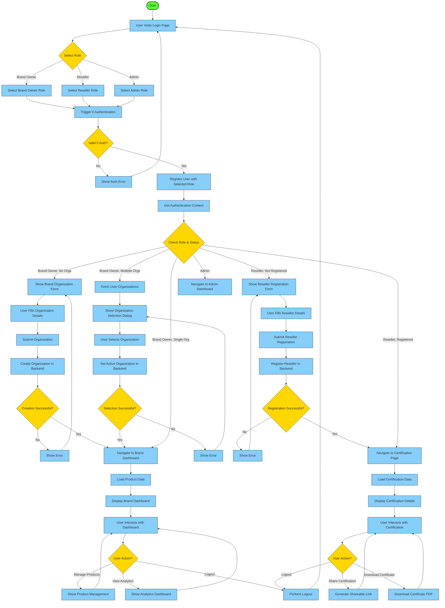
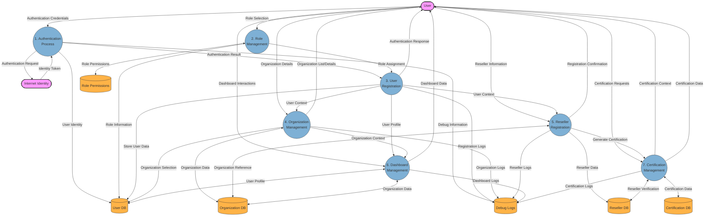

# TrueOrigin Authentication Flow Diagram

## Sequence Diagram for Authentication Flow

## State Diagram for User Authentication States

## Use Case Diagram

## Detailed Activity Diagram

## Data Flow Diagram

